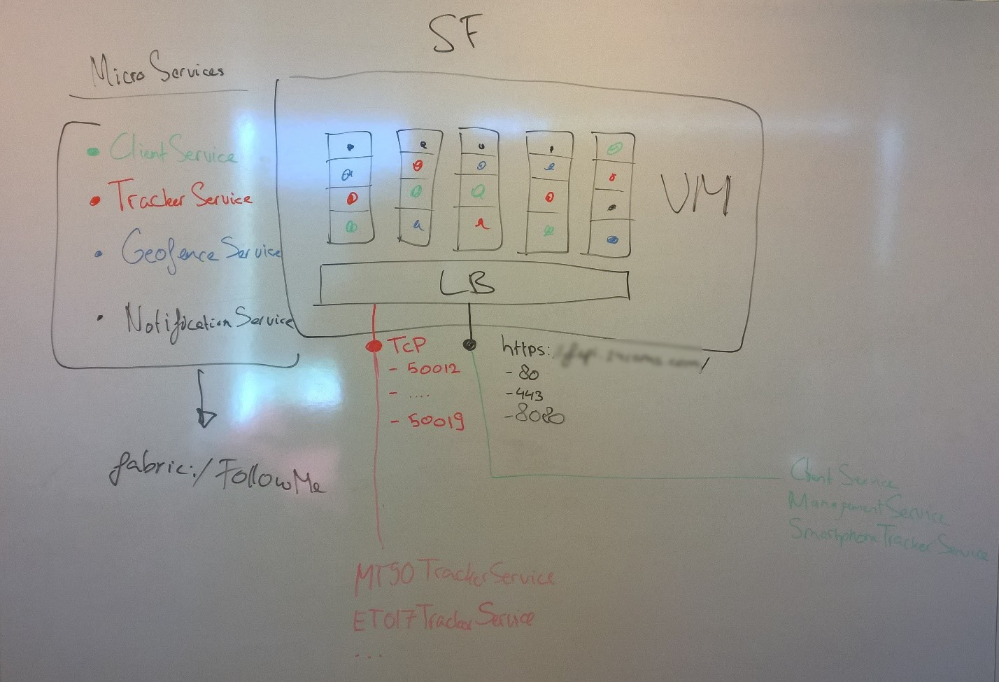
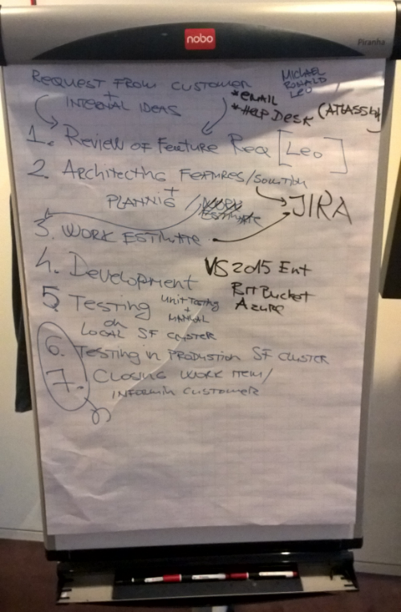
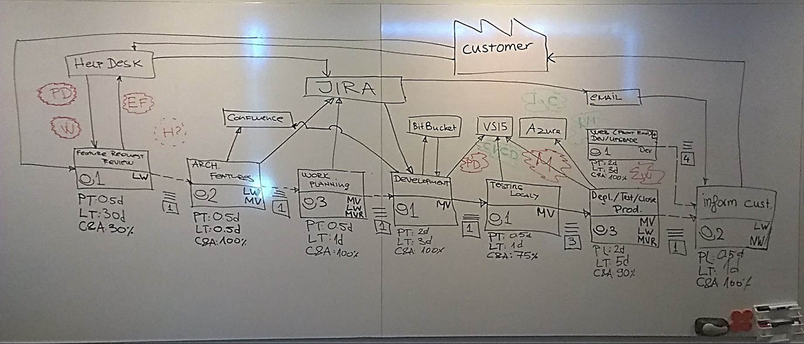
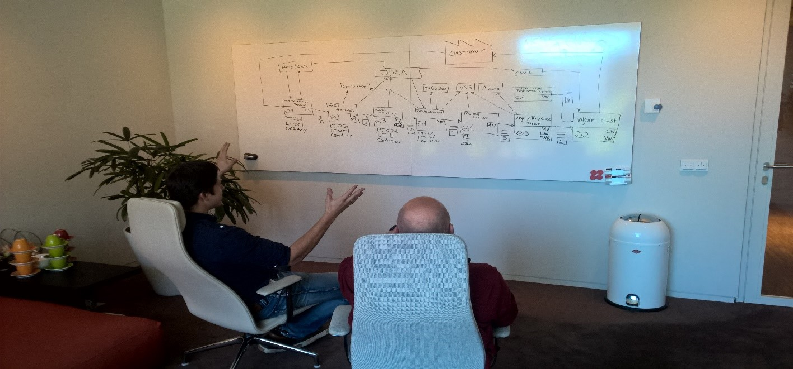
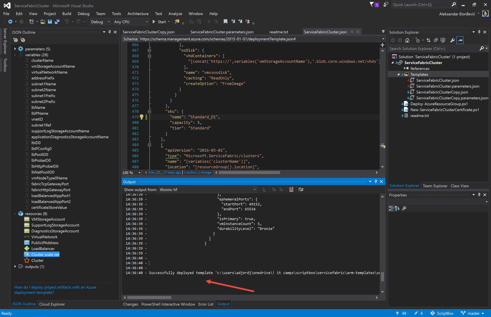

# DevOps Hackfest with 24Coms #

## The hack team ##

The team for this engagement consisted of following key profiles from 24Coms and Microsoft evangelists. 

**24Coms:**

- Leo Winder – Owner/CTO
- Michael Vlaar –  Development Engineer
- Leone Keijzer – Development Engineer
- Ronald Koster – Development Engineer 

**Microsoft:**

- Valery Jacobs (@valeryjacobs) – Senior Technical Evangelist 
- Aleksandar Dordevic (@Alex_ZZ) – Principal Technical Evangelist

## Customer Profile ##

24COMS empowers enterprises, SOHO (Small Office Home Offices) customers and end-users to self-organize the dynamics of their personal and business communications and information sharing. Targeted communication from a Control Center to the apps on mobile devices to manage efficient information and communication sharing. Reduce waste of time on nonsense messaging, create efficiency and end2end value in projects and collaborations between groups, teams, locations and individuals. 

24Coms are focusing on creating software solutions for Digital Social Communication, Geo-fencing, Phone as a Sensor, Location Based Innovations and etc., both for consumer and enterprise customers. Their unique solution provides new possibilities, in modern communications, by adding Geo-tracking dimension to convention communication mechanisms, information exchange and alerting. This solution is called 24Coms, and it is growing number of customers and companies.

More at [https://24coms.com ](https://24coms.com/ )

Our journey started with a meeting between 24Coms and Microsoft where we talked about how to practice more agile software development by applying DevOps practices. During this meeting, we narrowed down the options to executable and doable steps that would be inline and helpful to their DevOps journey.  The decision was made to deliver a Value Stream Map (VSM) workshop followed by a DevOps hackfest. First we did a 1 day VSM workshop at mid-August 2016 followed by a 3-day hackfest in Mid-September 2016.

 
## Problem Statement ##

24Coms teamed-up with Microsoft to optimize and accelerate their overall delivery pipeline and capacity to provision new customers to their platform. To discover areas of improvement and to narrow down the focus areas for the hackfest the team meet and started their DevOps journey with a Value Stream Map workshop. 

Before starting the Value Stream Map process an agreement was made on what the focus of the workshop should be regarding the solution and its components. The 24Coms team wanted to focus on their recently refactored backend service called “Follow me”. Previously this was a big monolithic application and they turned this into a micro service based application. 

24Coms designed this solution as an Azure Service Fabric implementation and already they are running their production environment on this new architecture. The focus of the conversation with 24Coms was on the operations pipeline and we discovered that most of the impact during the hackfest could be at this backend service. The next step was the Value Stream Map workshop.

In the VSM workshop we captured the high-level conceptual architecture of the solution, so everyone could understand what the solution would look like and what the characteristics of a micro service implementation are. 

Originally the architecture was based on Cloud Services and a big dependency on Azure Service Bus. The performance limitations of this approach were severe and an alternative had to be found to improve scalability and ease of deployment.

With the original approach their performance limit was 250 msg/s which meant they had to scale on a per Service Bus namespace basis which would have caused a lot of management overhead and even would max out the subscription quota for the maximum amount of Service Bus namespaces as their throughput requirements are way beyond what is offered currently with this service. They target servicing up to 100.000+ devices which can potentially submit messages frequently depending on circumstances (alert situations, big events, etc.)

During earlier conversation with 24Coms Service Fabric was mentioned as it could offer the opportunity to build a solution on top of a framework that had reliability, scalability and upgrade flexibility build in from the start. 

The result of the migration to micro services were 4 different services.

- Client Service
- Tracker Service
- Geofence Service
- Notification Service

Client to these services are specialized tracking devices or smartphones running iOS, Android or Windows. Transport security and message level security are based on encryption and access tokens. All services are running within a Service Fabric cluster with a couple of dependencies on external services.

After drawing up the solution the discussion continued on what areas of improvement were the most important for 24Coms’ business.

The Value Stream Mapping workshop started with their CTO and development lead. We determined all the steps that were involved in their existing life-cycle management procedure. This gave us insights in the effort it took the company to get from a great idea to a successful deployment in production and how such a deployment would evolve over time as a result of measuring customer usage and feedback.

The outcome of the investigation were the 6 core steps they employ in their development practices and these would the subject of investigation for optimizing and automating the overall process.

Based on the VSM we identified areas of improvement. The process of development and releasing showed to most potential for improvement. Basically they were facing the challenge of a startup that needs to develop at a high velocity while at the same time handled a lot of changes to existing parts of the system as well as parts that were under construction. It was clear to a team that, if the aim was to have a more predictable, manageable and sustainable delivery process that most of the manual work needs to be converted into automated tasks. 

It should not be left unnoted that this process by itself was very fruitful for the team. They took the opportunity to look back and get a good grip on what they wanted and needed to change. 

The workshop resulted in a set of goals for the rest of the Ascend+ engagement:

- **Implement Continuous Integration and Continuous Deployment (CI/CD)**
	- Implement automated Builds of Development output
- **Implement Infrastructure as Code (IaC) and Configuration Management**
	- Declare Environments via ARM to achieve a better level of automatization and predictability. In addition, apply Infrastructure as Code and Release Management practices 
- **Implement Release Management (RM)**
	- Moving and Deploying the application to different environments during its lifecycle
- **Innovation of development process and people skill development**
	- Leverage innovation and accelerate future feature development by planning and scheduling development of new skills, practices & tools as a standard way of working and planning.
	- Creating smaller deployment batches, drive development towards continuous innovation and, as a result, let their business be more agile.

## Solution, steps and delivery  ##

The next step was a 3-day hackfest at the Microsoft office in Schiphol-Rijk. We did a couple of preparation call prior to the event so everybody could start well informed and fully equipped. The goals set during the VSM workshop were translated into concrete activities for the hackfest.

**High level goals:**
 
1.	Create a secure Azure Service Fabric cluster    
	- Certificate to secure the cluster
	- Azure Key Vault holding the certificate
	- ARM template to setup the full cluster (IaC)
2.	Connect VSTS & Azure Service Fabric
	- New VSTS project
	- Push code into the repositories
	- Create Builds definitions for multiple projects (CI)
	- Create Release definitions for multiple environments (CD/RM)
3.	Build, Ship & Test
	- Apply software changes and test the overall delivery pipeline
	- Check the versioning of the application and how it gets upgraded in Service Fabric
	- Test the platform including load testing using VSTS web test and virtual user resources

The rest of this chapter will describe the journey and learnings we encountered executing these tasks.

## Creating secure Azure Service Fabric ##
According to the plan the first step was creating an ARM template to provision a secure Azure Service Fabric cluster. At that point 24Coms were provisioning their clusters for test, staging and production manually using the Azure portal. To be more agile and in line with DevOps practices the template would be used as the base for the cluster that would be used during the hackfest.

Our starting point [was the Azure QuickStart templates at GitHub](https://github.com/Azure/azure-quickstart-templates), where we found an adequate template that was tuned to their specific needs. The template used was the [5 Node secure Service Fabric Cluster with WAD enabled](https://github.com/Azure/azure-quickstart-templates/tree/master/service-fabric-secure-cluster-5-node-1-nodetype-wad).

> Copying and pasting ARM templates from Github can result in invalid json files. To prevent this any advanced text editor could be used to make sure there are no hidden characters present in the file. We have been using Visual Studio and Visual Studio Code at this hackfest when creating IaC.

> Before deploying an ARM template, check the Core quota of the subscription. In case there are not enough cores available the error message notifying this might not be instantly visible and this could lead to confusion. 

To setup the security assets we used a very helpful PowerShell module on GitHub that helped with securing and populating an Azure Key Vault to secure communication with the Azure Service Fabric management endpoints. [https://github.com/ChackDan/Service-Fabric#microsoft-azure-service-fabric-helper-powershell-module ](https://github.com/ChackDan/Service-Fabric#microsoft-azure-service-fabric-helper-powershell-module)

The majority of the template was straight forward with one notable addition for linking the cluster to the certificate in the Azure Key Vault.

We discussed the options for the certificate to be used for securing the cluster. Since they need to hook multiple domain names for white-labeling their service to customers a wild card certificate would have made sense but 24Coms preferred not to use this type of certificate due to speculated security degradation involved. In the end we opted for the approach where the certificate would use add CN names. A 2K key was used instead of a 4k key because some tracking devices have too limited resources to handle these large keys.

Here a snippet from the ARM parameters file indicating the setup of the KeyVault based certificate:

        "certificateThumbprint": {
      "value": "99912345o458045827c723047234"
    },
    "sourceVaultvalue": {
      "value": "/subscriptions//resourceGroups/<Resource group name>/providers/Microsoft.KeyVault/vaults/<vault name>"
    },
    "certificateUrlvalue": {
      "value": "https://<name of the vault>.vault.azure.net:443/secrets/<exact location>"
    },

A more detailed description of these steps were published on Github and can be found [here](https://github.com/djzeka/VSTS-AzureServiceFabric/blob/master/docs/Creating%20secure%20Azure%20Service%20Fabric%20Cluster.md).
